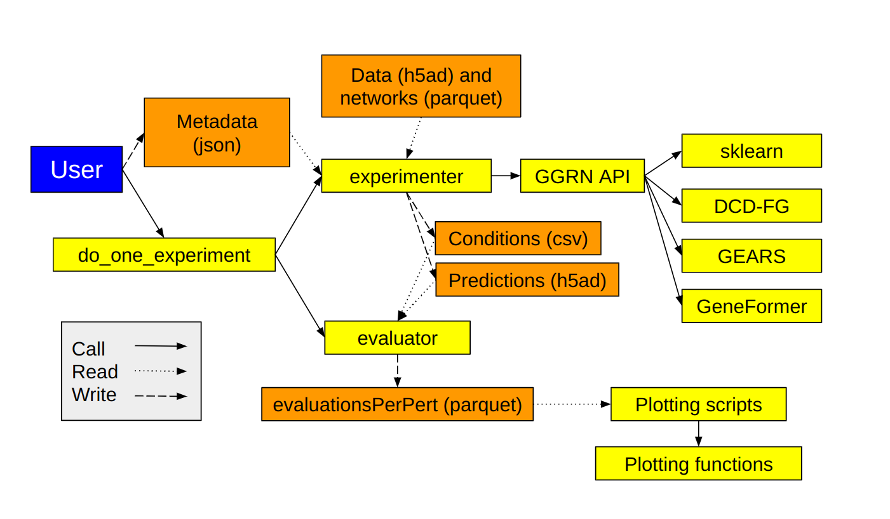

## Reference documentation for benchmarking infrastructure



### Basic operations 

The benchmarks in this project are composed of small, structured folders called Experiments. 

- Metadata fully describing each Experiment lives in a file `experiments/<experiment_name>/metadata.json`. 
- Outputs go to `experiments/<experiment_name>/outputs`. 
- By convention, stdout and stderr go to `experiments/<experiment_name>/{stdout.txt|err.txt}`. 

To run the experiment specified by `experiments/1.0_0/metadata.json`, we would do:

```bash
cd perturbation_benchmarking
conda activate ggrn
python do_one_experiment.py --experiment_name 1.0_0 --amount_to_do missing_models --save_trainset_predictions \
    > experiments/1.0_0/stdout.txt 2> experiments/1.0_0/err.txt
```

To see the reference manual describing the flags used in that call, run `python do_one_experiment.py -h`.

### Metadata specifying an experiment

Experiment metadata files are JSON dictionaries. Most simple entries can be either a single value, or a list. If a list is provided, the experiment is run once for each item in the list. If multiple keys have lists, combinations will be used (see `expand` below). 

With apologies, many metadata keys have idiosyncratic formatting and meaning. 

- `perturbation_dataset` describes a dataset using the same names as our perturbation dataset collection. Only one dataset is allowed per Experiment. 
- `readme` describes the purpose of the experiment. 
- `nickname` conveys the essence curtly. 
- `unique_id` must match the folder the Experiment is in.
- `question` refers to `guiding_questions.txt` in this repo. 
- `is_active` must be `true` or the experiment won't run. 
- `skip_bad_runs`, if `true`, will allow an Experiment to continue if one condition encounters an error. Set this to `false` for easier debugging.
- `refers_to` points to another Experiment. If A refers to B, then all key/value pairs are copied from B's metadata unless explicitly provided in A's metadata. You may not refer to an experiment that already refers to something. You may not refer to multiple experiments.
- `expand` can be either `"grid"` or `"ladder"`. It governs how the metadata are combined into a table of experimental conditions. If you set `expand` to `"grid"` (default), then it works like the base R function `expand.grid`, creating a dataframe with all combinations. If you set `expand` to `"ladder"`, then it works like the base R function `cbind`, using the first items of all lists, then the second, etc. For example, if you specify `"data_split_seed":[0,1,2]` and `"method":["mean", "median", "RidgeCV"]`, then the default `"expand": "grid"` is to test all 9 combinations and the alternative `"expand": "ladder"`  tests the mean with seed 0, the median with seed 1, and RidgeCV with seed 2. 
- `kwargs` is a dict of keyword args passed on to GEARS, or DCD-FG, or any method [wrapped via Docker](https://github.com/ekernf01/ggrn_docker_backend). By default, lists inside kwargs do not get `expand`ed as described above. If you want to do a hyperparameter grid search or similar, you need to use `kwargs_to_expand`. For example, if you have `"kwargs":{"penalty": [1,2,3], "dimension": [5,10]}` then you can search all six combinations by setting `kwargs_to_expand = ["penalty", "dimension"]`. 
- `data_split_seed`: integer used to set the seed for repeatable data splits.
- `type_of_split`: how the data are split. This option is fully documented in the docstrings for our data splitter functions. 
    - if "interventional" (default), then any perturbation occurs in either the training or the test set, but not both. 
    - If "simple", then we use a simple random split, and replicates of the same perturbation are allowed to go into different folds or the same fold.
    - If "genetic_interaction", we put single perturbations and controls in the training set, and multiple perturbations in the test set.
    - If "demultiplexing", we put multiple perturbations and controls in the training set, and single perturbations in the test set.
    - If "stratified", we put some samples from each perturbation in the training set, and if there is replication, we put some in the test set. 
    - If "custom", we load the test set from the file 'custom_test_sets/<data_split_seed>.json'.
- `baseline_condition` DEPRECATED. This is a number, most often 0. This experimental condition, which corresponds to the same-numbered h5ad file in the `predictions` output and the same-numbered row in the `conditions.csv` output, is used as a baseline for computing performance improvement over baseline.
- `network_datasets` describes a GRN using the same names as our network collection. The behavior is complicated because the network collection separates out tissue-specific subnetworks. The value is a dict where keys are network sources and values are (sub-)dicts controlling specific behaviors.
    - To use certain subnetworks, set `subnets` to a list naming them. To use all, set subnets to all (default).
    - To take the union of the subnetworks, set `do_aggregate_subnets` to `true`. To keep subnetworks separate, set `do_aggregate_subnets` to `false` (default).
    - You can use `empty` or `dense` for a network with no edges or all possible edges. Default is `dense`. 
    - An example from experiment `1.3.2_9`:

            "network_datasets": {
                "empty": {},
                "dense": {},
                "magnum_compendium_394": {
                    "subnets": [
                        "retinal_pigment_epithelial_cells.parquet",
                        "chronic_myelogenous_leukemia_cml_cell_line.parquet",
                        "teratocarcinoma_cell_line.parquet",
                        "lung_adenocarcinoma_cell_line.parquet",
                        "breast_carcinoma_cell_line.parquet",
                        "embryonic_kidney_cell_line.parquet",
                        "hepatocellular_carcinoma_cell_line.parquet",
                        "epitheloid_cancer_cell_line.parquet",
                        "acute_myeloid_leukemia_fab_m5_cell_line.parquet"
                    ],
                    "do_aggregate_subnets": false
                }
            }
        

You can add standard GGRN args to the metadata; they are documented in the [ggrn repo](https://github.com/ekernf01/ggrn). There are some components not yet documented. If this becomes an obstacle to you, file a github issue and we'll try to help out. If you need to study or alter the code, most code implementing these behaviors is in the `experimenter` module of the [perturbation benchmarking package](https://github.com/ekernf01/perturbation_benchmarking_package). Use `perturbation_benchmarking_package.experimenter.get_default_metadata()` to see the default values of each metadata field. Use `perturbation_benchmarking_package.experimenter.get_required_keys()` to see which keys are required. Use `perturbation_benchmarking_package.experimenter.get_optional_keys()` to see optional keys.  

### Outputs

Here is an annotated layout of files and folders produced for each Experiment.

```bash
├── conditions.csv # All combinations of values provided in the metadata.  
├── new_conditions.csv # This is generated and compared to any existing conditions.csv to prevent confusion upon editing metadata.
├── genes_modeled.csv # The genes included in this experiment.
├── mae.svg # Mean absolute prediction error for each test set observation
├── evaluationPerPert.parquet # Table of evaluation metrics listed separately for each observation in the test data, readable by e.g. pandas.read_parquet()
├── evaluationPerTarget.parquet # Table of evaluation metrics listed separately for each feature in the test data, readable by e.g. pandas.read_parquet()
├── targets 
│   ├── predictability_vs_in-degree.svg # Display of MAE of groups of targets stratified by in-degree in our networks.
│   ├── variety_in_predictions # Histogram meant to answer, "Are the predictions roughly constant?"
│   ├── enrichr_on_best # Enrichr pathway analysis of best-predicted targets for each condition in this experiment.
│   ├── best # Scatterplots of predicted vs observed for the best-predicted targets.
│   ├── random # Scatterplots of predicted vs observed for a few randomly chosen targets.
│   └── worst # Scatterplots of predicted vs observed for the worst-predicted targets.
├── perturbations # Same as targets but stratified by perturbation instead.
├── train_resources # Folder of CSV files with records of walltime and peak RAM consumption for each training run; one file per row of conditions.csv.
├── fitted_values # Predictions on training data ...
│   ├── 0.h5ad # ... from row 0 of conditions.csv
│   ├── 1.h5ad # ... from row 1 of conditions.csv
│   ├── ...
├── predictions # Predictions on test data 
│   ├── 0.h5ad 
│   ├── 1.h5ad
│   ├── ...
└── trainset_performance # Same parquet files and plots as above, but for train-set
    ├── evaluationPerPert.parquet
    ├── evaluationPerTarget.parquet
```

Here is a description of the columns of `evaluationPerPert.parquet` and `evaluationPerTarget.parquet`.

- Evaluation metrics: `cell_type_correct, spearman, mse_top_20, mse_top_100, mse_top_200, mse, mae, proportion_correct_direction`. `mae` is mean absolute error. `mse` is mean squared error. `mse_top_n` is the mean squared error on the n genes with highest test-set fold change. `proportion_correct_direction` is the proportion of genes going up (if they were predicted to go up) or down (if they were predicted to go down). `spearman`  is the Spearman correlation between the predicted log fold change and the observed log fold change, and `spearmanp` is the corresponding p-value. `cell_type_correct` is based on discrete training-set labels derived from predicted expression. `standard_deviation` measures not accuracy but rather how close the predictions are to just being constant. Many of these are only available per-pert or per-target and not both. `mae_baseline` and `mae_benefit` are for comparing each condition to a baseline but are now deprecated. New evaluation metrics will appear next to these; see `how_to.md` for more information. 
- Experimental conditions that match `metadata.json` and `conditions.csv` (more detail on these below): `perturbation index condition unique_id nickname question data_split_seed type_of_split regression_method num_genes eligible_regulators is_active facet_by color_by factor_varied merge_replicates perturbation_dataset network_datasets refers_to pruning_parameter pruning_strategy network_prior desired_heldout_fraction starting_expression feature_extraction control_subtype predict_self low_dimensional_structure low_dimensional_training matching_method prediction_timescale baseline_condition target mae_baseline mae_benefit`
- `gene`: the target gene (in `evaluationPerTarget.parquet`) or the perturbed gene (in `evaluationPerPert.parquet`) 
- Degree from our network collection: `in-degree_*` or `out-degree_*`
- Merged from per-gene metadata on transcript structure and mutation frequency: `transcript chr n_exons tx_start tx_end bp mu_syn mu_mis mu_lof n_syn n_mis n_lof exp_syn exp_mis exp_lof syn_z mis_z lof_z pLI n_cnv exp_cnv cnv_z`
- Expression characteristics of this gene in the training data: `highly_variable highly_variable_rank means variances variances_norm`
- Strength and reproducibility of the perturbation effects: `logFCNorm2 pearsonCorr spearmanCorr logFC`. Note: `logFC` refers to the targeted transcript only while `logFCNorm2` refers to global effect size. Only available in `evaluationPerPert.parquet`.

